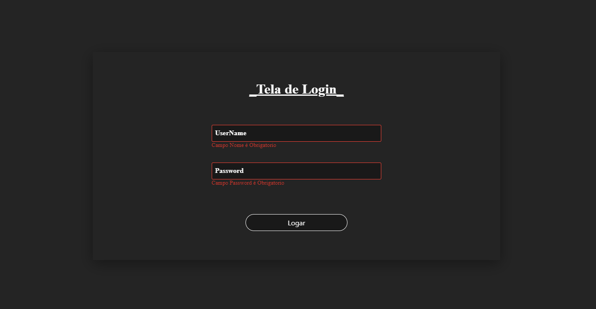
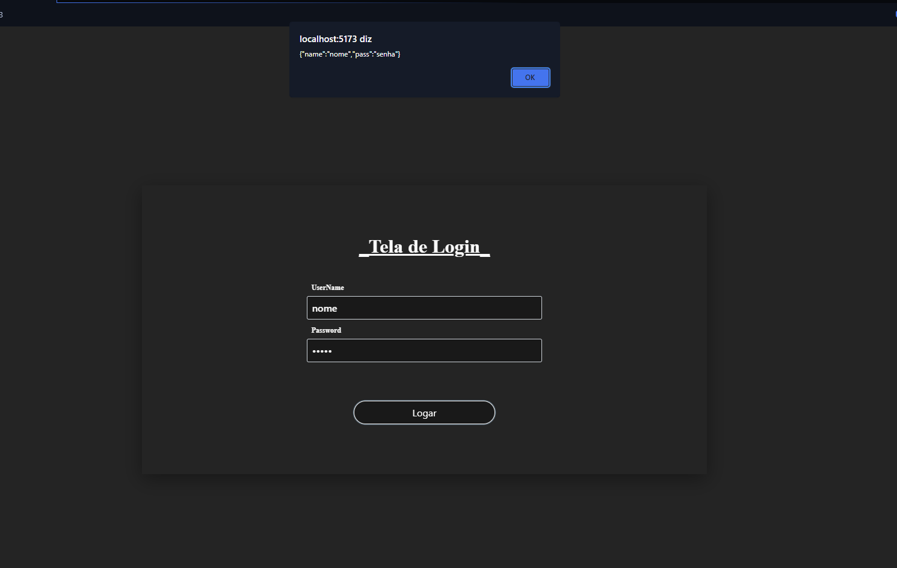
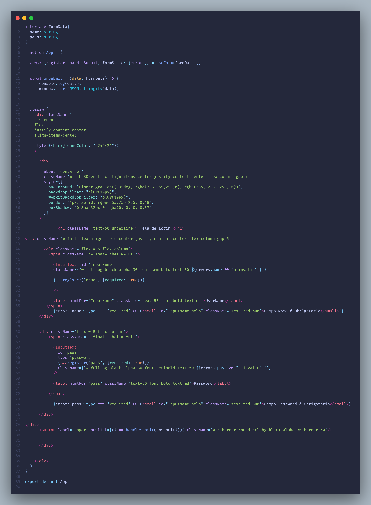

<h3 align="center">Formulario feito com o React.TS, PrimeReact e React-Hook-Form</h3>

  
  
  
  

  <h1 align="center">Tela Padrão</h1>

  

  <h1 align="center">Tela Com Error de Required</h1>

  

  <h1 align="center">Tela sem Error Com o objeto criado pela Lib</h1>

  

  <h1 align="center">Código</h1>

  

<h3 align="center">Repo para consulta pessoal sobre a biblioteca REACT-HOOK-FORM</h3>